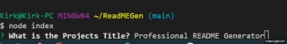

# ReadMEGen

In this project we are to create a console line app that gathers user info and turns it into a professional ReadMe.md file.

my repository can be reached [Here](https://github.com/kirkh43064/ReadMEGen).

the video of the application can be watched [Here](https://drive.google.com/file/d/13eUVvemcZLrjdyUEBhAMaJfLK3vZa5N8/view).